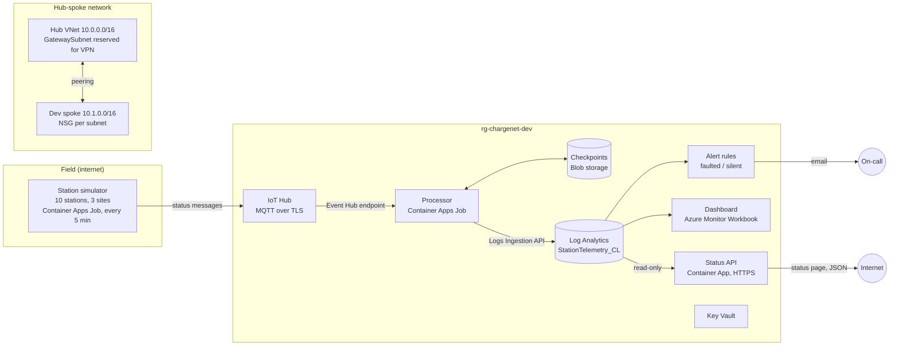
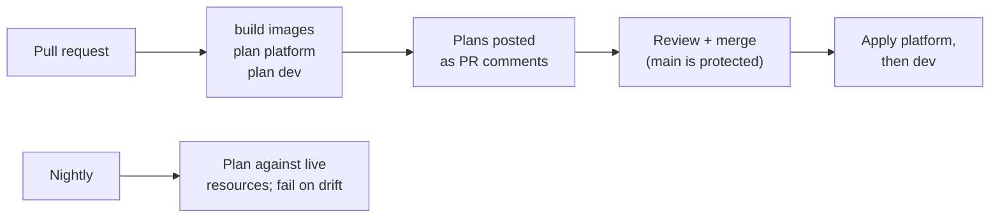

# ChargeNet

[](https://github.com/watavares/chargenet/actions/workflows/terraform.yml)

A working miniature of the cloud platform behind an electric truck charging network, built on Azure with Terraform and GitHub Actions.

Simulated charging stations at three depots report their status every five minutes. The platform ingests that telemetry through IoT Hub, stores it in Log Analytics, alerts when a station breaks or goes silent, and shows the network on a live dashboard. Everything is deployed through pull requests, with no portal clicks and no stored credentials.

## Architecture



The simulator deliberately runs outside the VNet: it stands in for chargers in the field, which reach IoT Hub over the internet.

## What's running

| Component | Azure service | Purpose |
|---|---|---|
| Station simulator | Container Apps Job | 10 stations send status, power and energy over MQTT every 5 minutes. Faults and outages persist for an hour, like real incidents; an offline station sends nothing. |
| Ingestion | IoT Hub (Free tier) | Authenticates devices and buffers their messages. |
| Processor | Container Apps Job | Moves new messages into Log Analytics. Checkpoints only after a successful write, so a failed run re-reads instead of losing data. |
| Telemetry store | Log Analytics custom table | Every reading, queryable with KQL, 30-day retention. |
| Alerting | Scheduled query rules + action group | One alert per station, auto-resolving: **Faulted** for 20+ minutes, or **Silent** for 20+ minutes. A silent network also means the pipeline itself has failed. |
| Dashboard | Azure Monitor Workbook | Status tiles, station board, power and energy per site, fault history, pipeline throughput and delay. Defined in Terraform. |
| Status API | Container App (scale to zero) | Public status page and read-only JSON (`/api/stations`, `/api/sites`, `/api/docs`). Cached for 60 s. Exposure is a recorded decision: [ADR 0001](docs/decisions/0001-public-status-api.md). |
| Secrets | Key Vault (RBAC, network closed) | For secrets that can't be replaced by managed identity, like VPN keys and device certificates. |

## Landing zone

`infra/platform` owns everything shared, and applies to the whole subscription.

**Guardrails (Azure Policy, Deny):**
- Resources only in `northeurope`
- Every resource group tagged with `project` and `env`
- No public IP addresses

**Cost control:** a monthly budget with email alerts at 50%, 80% and 100%, plus a forecast alert.

**Network:** hub-spoke. The hub holds shared connectivity (the VPN gateway goes in its `GatewaySubnet`); each environment gets a spoke peered to it.

| Network | Address space |
|---|---|
| Hub | 10.0.0.0/16 |
| Dev spoke | 10.1.0.0/16: `snet-apps` 10.1.0.0/23, `snet-private-endpoints` 10.1.2.0/24 |

**Environment vending:** for each entry in `var.environments`, the platform creates the environment's resource group, its spoke network (in a separate resource group, with an NSG per subnet), its workload identity, and its deploy identity's permissions. Adding an environment is one map entry.

## Identity and access

Least privilege throughout. Nothing authenticates with a stored password except where Azure offers no alternative, and those are noted.

| Identity | Used by | Rights | Credential |
|---|---|---|---|
| `sp-chargenet-github-platform` | Platform pipeline | Contributor and Resource Policy Contributor on the subscription; RBAC Administrator **with a condition** that blocks granting Owner, User Access Administrator or RBAC Administrator, so it can never escalate | OIDC federation, no secret |
| `sp-chargenet-github-dev` | Dev pipeline | Contributor on `rg-chargenet-dev` only; can't touch the network, policy or other environments | OIDC federation, no secret |
| `id-chargenet-dev-workload` | Processor | Storage Blob Data Contributor and Monitoring Metrics Publisher on `rg-chargenet-dev` only | Managed identity, no secret |
| `id-chargenet-dev-api` | Status API (internet-facing) | Log Analytics Reader on `rg-chargenet-dev` only; deliberately separate from the processor's write access | Managed identity, no secret |
| IoT Hub `simulator` policy | Simulator | Register devices and connect as them (the gateway pattern); can't read or change hub configuration | Key, stored as a Container Apps secret; devices only ever send 1-hour tokens |
| IoT Hub `processor` policy | Processor | Read device messages only | Key, stored as a Container Apps secret. IoT Hub's Event Hub endpoint doesn't support Entra ID. |

Both pipeline identities trust only GitHub jobs from this repository running in their own GitHub environment. The checkpoint storage account has shared keys disabled entirely.

## Delivery



- **Pull requests** build both container images and plan every layer. Each plan is posted as a PR comment, so reviewers see exactly what will change.
- **Merging to `main`** applies exactly the plan that was just made, platform first. Applies never overlap.
- **Nightly,** a plan runs against live resources and fails if anything was changed outside Terraform.
- **`main` is protected:** every change goes through a pull request, the build and both plans must pass, and the rules apply to admins too.
- **Images** are tagged by a hash of their source, so an app is only rebuilt and redeployed when its code changes.

Each layer has its own Terraform state file and its own deploy identity, so a mistake in an environment can't damage the platform.

## Design decisions

| Decision | Why |
|---|---|
| Terraform, with `azapi` only where `azurerm` has gaps | Most widely used IaC for Azure; `azapi` covers the custom Log Analytics table schema. |
| Platform and environments as separate layers | Mirrors a platform team vending landing zones to app teams; limits the blast radius of each pipeline. |
| OIDC federation and managed identities | No secrets to rotate or leak. The only keys left are where Azure supports nothing else. |
| Scheduled Container Apps Jobs, not always-on apps | The workload is periodic; jobs bill per second and stay inside the free grant (an always-on app would cost about €10 a month). |
| Logs Ingestion API into a custom table | Typed, queryable data with KQL for alerts and dashboards, and no extra database to run. |
| Deny public IPs by policy | Nothing gets exposed by accident. Public endpoints become a deliberate, reviewed exception. |
| Built-in Container Apps ingress for the status API (dev) | €0 instead of €150–300/month for Application Gateway or Front Door. Read-only identity, caching and a replica cap bound the risk. Production would move behind Front Door Premium with Private Link. See [ADR 0001](docs/decisions/0001-public-status-api.md). |

## Cost

Built to run continuously on a small budget.

| Item | Monthly |
|---|---|
| IoT Hub Free tier (8,000 messages/day) | €0 |
| Container Apps Jobs | €0 (within the free grant) |
| Log Analytics ingestion | €0 (well under the free allowance) |
| Two log alert rules | about €1–3 |
| Storage, Key Vault, networking | cents |

The budget alert is set at €20.

## Repository layout

```
chargenet/
├── bootstrap/             one-time setup: Terraform state storage, pipeline identities
├── infra/
│   ├── platform/          policy, budget, hub network, environment vending
│   └── envs/dev/          IoT Hub, jobs, telemetry pipeline, alerts, dashboard, Key Vault
├── simulator/             station simulator (Python, MQTT)
├── processor/             IoT Hub → Log Analytics processor (Python)
├── api/                   public status page and JSON API (Python, FastAPI)
├── docs/decisions/        architecture decision records
└── .github/workflows/     build, plan, apply, drift check
```

## Rebuilding from scratch

1. Run `bootstrap/bootstrap.ps1` to create the Terraform state storage.
2. Run `bootstrap/github-oidc.ps1` for each pipeline identity:
   - `-env platform -roles Contributor,"Resource Policy Contributor" -allowRoleAssignments`
   - `-env dev`
3. Create the GitHub environments `platform` and `dev` with the variables the script prints, plus `BUDGET_EMAIL` on `platform` and `ALERT_EMAIL` on `dev`.
4. Add the dev identity's object ID to `var.environments` in `infra/platform`.
5. Push to `main`. The pipeline builds the images and deploys platform, then dev.

## Roadmap

- [x] Landing zone: policy guardrails, budget, hub-spoke network, least-privilege pipeline identities
- [x] IoT ingestion, simulator, processor, alerts and dashboard
- [x] Public status API on Container Apps, with the exposure decision recorded
- [ ] Hybrid connectivity: site-to-site VPN to a simulated depot network
- [ ] Acceptance and production environments, with approval gates on production
- [ ] Incident write-ups: deliberate failures, detection, root cause and fix
